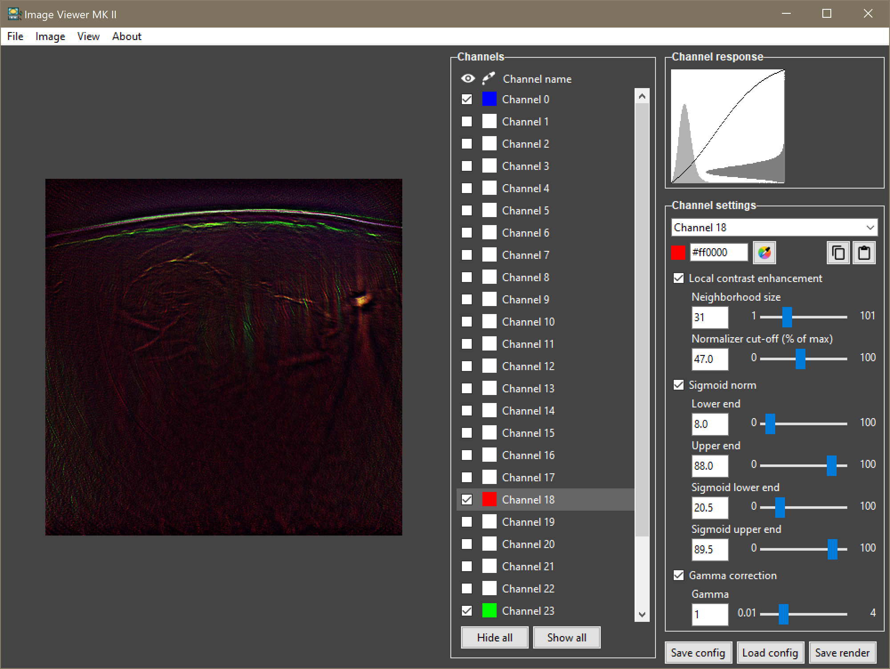

# Image viewer Mk2
Viewer for spectral images, in particular suitable from multispectral optoacoustic tomography.




## Installation

```
pip install image-viewer-mk2==1.0.1
```

See [dependencies](https://github.com/jankukacka/image_viewer_mk2/blob/master/dependencies.md) for versions of dependency libraries that were tested with this software but are not strictly required during installation.
See [releases](https://github.com/jankukacka/image_viewer_mk2/releases) for older versions.

## Usage

**From command line as a standalone application.**
```
> imvmk2 [-i filename] [-c config_filename] [-d (debug)]
```

**From within python scripts and interactive sessions.** The viewer can be either used as an interactive image viewer, giving the user the ability to manually adjust the settings. The rendered image is returned back so that it can be further used inside the script.
```python
import image_viewer_mk2.app as imv

img = np.zeros((height, width, channels))
render = imv.start(image=img)
```

Alternatively, it can be used to apply existing configuration and directly return a rendered image without opening the interactive GUI:
```python
import image_viewer_mk2.app as imv

img = np.zeros((height, width, channels))
render = imv.render(image=img, config_filename='config.json')
```

Configuration files can be saved from the interactive GUI or they can be returned as a second return value in the script by passing parameter `return_config=True` to the call `imv.start()`.


## Troubleshooting

```
TclError: image "pyimageXX" doesn't exist
```
When using in interactive session, all other matplotlib figures have to be closed. Calling `matplotlib.pyplot.close(fig='all')` should do the trick.

## Credits
This software reuses code and icons produced by: Alistair Muldal, cilame, Benjamin Johnson, Remin Emonet, [Icon home](https://www.flaticon.com/authors/icon-home), [Gregor Cresnar](https://www.flaticon.com/authors/gregor-cresnar), [Freepik](https://www.flaticon.com/authors/Freepik), [Google](https://www.flaticon.com/authors/google), Uptal Barman, [Arkinasi](https://www.flaticon.com/authors/arkinasi), [Royyan Wijaya](https://www.flaticon.com/authors/royyan-wijaya), and Pancracysdh.

## License
The software is provided under the [MIT open license](LICENSE.txt).

## Citation
If you use this software for your research, please cite it as:
```
Kukačka, Jan (2021). Image Viewer MK2 (v1.0.0) [Computer software]. https://github.com/jankukacka/image_viewer_mk2
```
