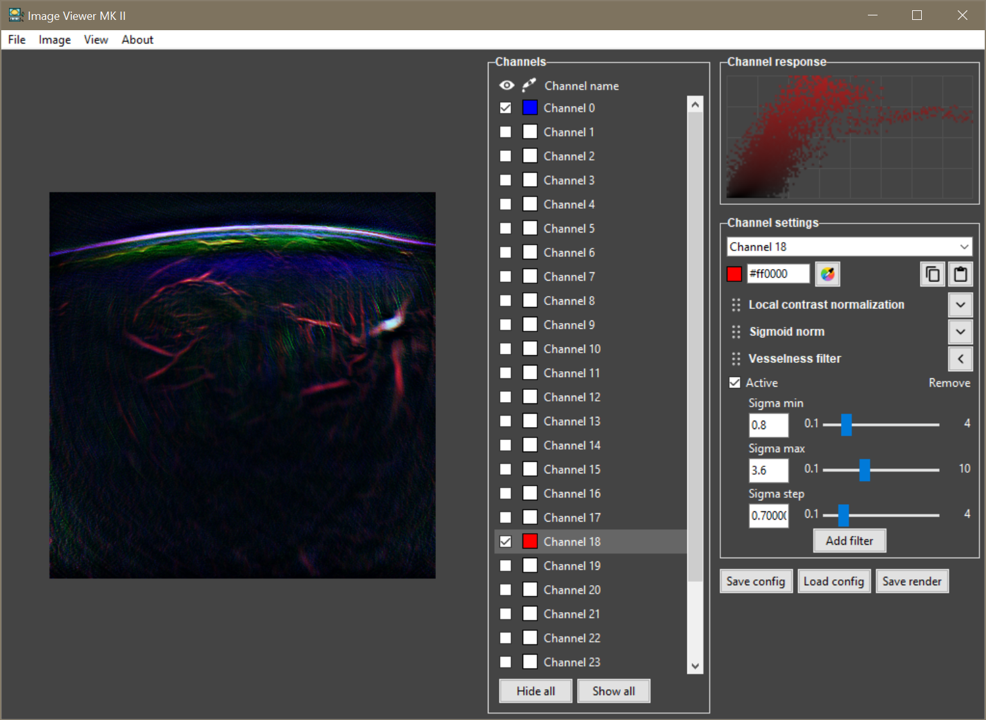

# Image viewer mk2
Viewer for spectral images, in particular suitable from multispectral optoacoustic tomography.




## Installation

```
pip install image-viewer-mk2
```

Additional dependencies must be installed separately: `happy` (currently not publicly available), optional: `PyTorch` (for GPU-based rendering), `pywin32` (Windows clipboard functionality)

## Usage

**From within python scripts and interactive sessions.** Image viewer returns the rendered image back so that it can be further used inside the script.
```
import image_viewer_mk2.app as imv

img = np.zeros((height, width, channels))
render = imv.start(image=img)
```

**From command line as a standalone application.**
```
> imvmk2 [-i filename] [-c config_filename] [-g (GPU) | -ng (No GPU)] [-d (debug)]
```

## Credits
This software reuses code and icons produced by: cilame, Benjamin Johnson, Remin Emonet, Icon home, Gregor Cresnar, Freepik, Google, and Pancracysdh

## License

The software is provided under the [MIT open license](LICENSE.txt).

## Citation
If you use this software for your research, please cite it as:
```
Kukačka, Jan (2021). Image Viewer MK2 (v0.2.1) [Computer software]. https://github.com/jankukacka/image_viewer_mk2
```
